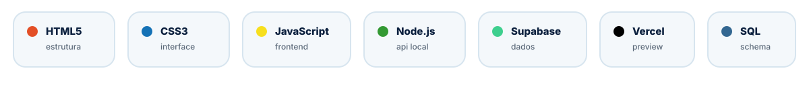
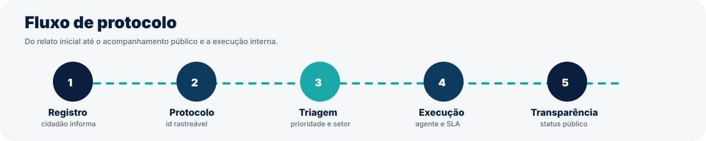
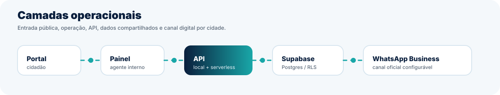
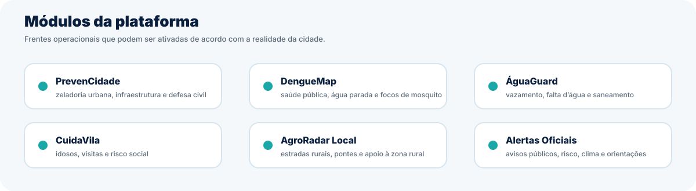

<div align="center">
  
</div>

<div align="center">


<br/>


</div>

<div align="center">
  
</div>

# CidadeOS AI

**CidadeOS AI** é uma plataforma govtech de atendimento, protocolo e inteligência urbana construída para transformar solicitações da população em fluxos operacionais rastreáveis.

O sistema foi pensado para cidades pequenas, secretarias, associações, distritos rurais, condomínios de grande porte e operações públicas que precisam sair de anotações soltas, grupos de mensagens e planilhas dispersas para uma rotina mais estruturada, transparente e orientada por dados.

O núcleo do produto organiza o ciclo completo de uma ocorrência: entrada pública, geração de protocolo, classificação, triagem, encaminhamento, atualização de status, histórico, SLA, transparência e base de crescimento para automações futuras.

<div align="center">
  
  
</div>

## O que a plataforma resolve

Relatos importantes costumam se perder em mensagens de WhatsApp, ligações, papéis, atendimentos informais e repasses sem rastreabilidade. O CidadeOS AI converte esse cenário em uma operação com protocolo, setor responsável, prioridade, histórico e capacidade de consulta.

O cidadão registra e acompanha. A equipe interna recebe, classifica e executa. A gestão passa a visualizar indicadores de atendimento sem expor dados pessoais da população.

## Como a operação funciona

```txt
O cidadão registra a solicitação pelo portal ou canal integrado.
A plataforma gera um protocolo único e salva o relato.
A ocorrência entra no painel com status, prioridade, bairro e origem.
O agente faz a triagem, assume, encaminha ou atualiza.
O cidadão consulta o protocolo e visualiza apenas a parte pública.
A cidade acompanha métricas e transparência em uma mesma base.
O WhatsApp Business entra como canal oficial configurado por cada cliente.
```

<div align="center">
  
  
</div>

## Camadas do sistema

###  Interface pública

Responsável pela experiência do cidadão. Reúne página inicial, abertura de ocorrência, consulta de protocolo, alertas oficiais, transparência e orientação institucional. A linguagem é simples, direta e pensada para quem quer registrar ou acompanhar uma solicitação sem atrito.

###  Painel interno

Área operacional da cidade. Concentra visão geral, ocorrências, setores, auditoria, status, prioridade, SLA, triagem e WhatsApp Business. A proposta é dar rotina clara ao agente: ver o que chegou, identificar urgência, encaminhar corretamente e manter histórico confiável.

###  API local

Servidor Node utilizado durante o desenvolvimento em localhost. Ele preserva testes rápidos, evolução incremental e validações sem depender do ambiente online a cada alteração.

###  API serverless

Camada preparada para Vercel em `api/[...path].js`. É ela que permite ao preview online acessar o Supabase com segurança, usando backend para operações sensíveis e mantendo o frontend desacoplado de credenciais críticas.

###  Supabase/Postgres

Base compartilhada do preview real. Centraliza ocorrências, protocolos, cidades, bairros, setores, alertas, métricas e estruturas operacionais, permitindo que testadores diferentes enxerguem os mesmos dados.

###  Supabase Storage

Estrutura preparada para anexos e fotos das ocorrências. Não é o foco principal desta fase, mas já faz parte da evolução natural da plataforma.

###  WhatsApp Business

Módulo configurável por cidade ou cliente. O produto não depende de um número fixo da plataforma: cada operação poderá informar o próprio canal oficial, templates, tokens e parâmetros da integração.

<div align="center">
  
  
</div>

## Módulos do produto

###  PrevenCidade

Frente de zeladoria urbana, infraestrutura e defesa civil, voltada a buracos, iluminação, lixo, risco em via, árvore caída e alagamento.

###  DengueMap

Camada orientada à saúde pública, focada em água parada, focos de mosquito, mutirões, terrenos abandonados e observações ligadas à dengue.

###  ÁguaGuard

Módulo para vazamentos, falta d’água, baixa pressão, esgoto irregular e acompanhamento de reincidência por região.

###  CuidaVila

Base futura para idosos e pessoas vulneráveis, com visitas, risco social e acompanhamento por responsável ou agente.

###  AgroRadar Local

Estrutura para zona rural, estradas, pontes, acessos, comunidades afastadas e impactos operacionais sobre produtores.

###  Alertas Oficiais

Área para avisos públicos, clima, risco, mutirões, campanhas e comunicados segmentados por cidade ou bairro.

<div align="center">
  
  
</div>

## Status do desenvolvimento

A versão atual está na **Fase 3.3**, com evidências operacionais, WhatsApp Cloud API, IA assistida opcional, duplicidade assistida, mapa operacional e painel executivo para gestores.

###  Já consolidado

```txt
portal público
registro de ocorrência
protocolo rastreável
consulta pública
painel interno
dashboard operacional
status e prioridade
triagem e SLA
triagem por regras locais com confirmação do agente
IA assistida opcional para resumo, risco e resposta sugerida
duplicidade assistida com candidatos, vínculo confirmado e arquivamento opcional
mapa operacional interno com filtro por bairro/região, pontos críticos e calor territorial
geolocalização opcional com privacidade por padrão
painel executivo com indicadores agregados, tendências, origem, bairros, categorias e setores
alertas oficiais
transparência pública
api serverless para vercel
supabase compartilhado
whatsapp business configurável
mídias do whatsapp vinculadas como evidências
documentação técnica e identidade visual
```

###  Em evolução

```txt
envio real pela cloud api do whatsapp em operações conectadas
criptografia reforçada por cidade
autenticação robusta de produção
analiticos preditivos e mapa de recorrencia
multi-tenant comercial
```

<div align="center">
  
  
</div>

## Roadmap executivo

O projeto já tem uma base forte consolidada e entra agora em uma zona de refinamento operacional e expansão funcional.

A próxima janela mais provável concentra:
- anexos reais
- WhatsApp real
- refinamento do painel
- refinamento da IA assistida preservando decisão humana
- reforço de autenticação
- preparação para operação multi-cidade

A estimativa visual acima resume a leitura atual: **aproximadamente 80% do núcleo do produto está consolidado**, com uma **janela de 15 a 30 dias** para uma nova rodada forte de avanço, considerando ritmo contínuo de desenvolvimento.

<div align="center">
  
  
</div>

## Natureza do repositório e uso

Este projeto é um repositório de portfólio, demonstração técnica e documentação de evolução de produto.

Ele existe para apresentar arquitetura, direção visual, fluxo funcional e capacidade de implementação. O código, a marca, o conceito de produto, a documentação, os fluxos e a identidade visual do **CidadeOS AI** são proprietários.

O repositório pode ser visualizado como referência de portfólio e apresentação, mas não deve ser copiado, revendido, redistribuído, clonado comercialmente ou reapresentado como produto próprio sem autorização.

<div align="center">
  
</div>
